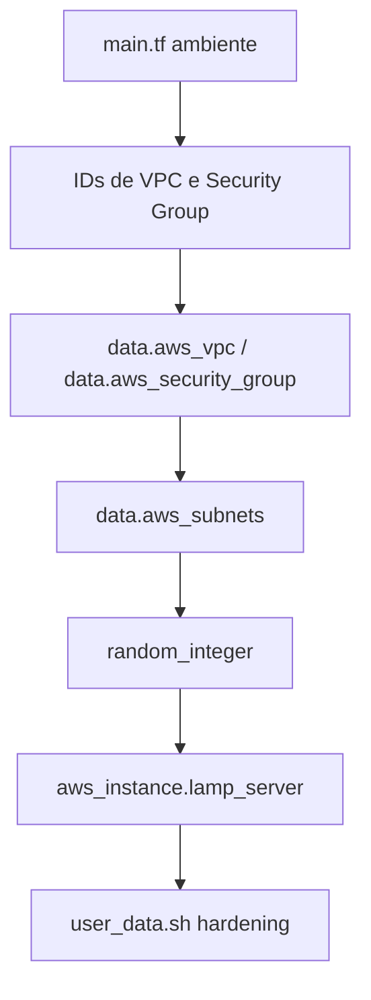

# Visão Geral da Arquitetura

Este repositório concentra um módulo Terraform reutilizável para disponibilizar uma instância Amazon EC2 endurecida em sub-redes públicas existentes. Os diretórios `terraform/ec2/dev` e `terraform/ec2/prod` consomem o módulo com variáveis distintas por ambiente.

## Fluxo de Provisionamento

1. **Entrada de IDs existentes** – Os arquivos `main.tf` dos ambientes recebem os IDs da VPC (`vpc_id`) e do Security Group (`security_group_id`) já criados previamente.
2. **Descoberta de sub-redes públicas** – O módulo consulta as sub-redes da VPC filtrando pela flag `map-public-ip-on-launch=true` para garantir o recebimento automático de IP público.
3. **Seleção aleatória de subnet** – Um recurso `random_integer` escolhe um índice aleatório dentro da lista de sub-redes públicas retornadas, distribuindo instâncias entre diferentes zonas de disponibilidade.
4. **Criação da instância EC2** – A instância é provisionada com AMI, tipo, par de chaves e configurações de volume definidos nas variáveis. O Security Group existente é anexado à instância.
5. **Hardening no boot** – O script `user_data.sh` embutido no módulo aplica atualizações, ajustes de SSH, desativa serviços considerados desnecessários e executa uma rotina de hardening para Amazon Linux 2023.

## Dependências e Pré-Requisitos

- **Recursos existentes:** VPC, sub-redes públicas com `map-public-ip-on-launch=true`, Security Group e par de chaves criados previamente.
- **Permissões AWS:** Política capaz de listar VPCs, sub-redes, Security Groups e criar instâncias EC2.
- **Terraform:** Versão compatível com os providers `hashicorp/aws (~> 6.10)` e `hashicorp/random (~> 3.7)` declarados nos ambientes.
- **Sistema operacional:** O `user_data.sh` assume Amazon Linux 2023; utilizar AMIs diferentes pode causar falhas na rotina de hardening.

## Convenções de Tags e Armazenamento

- Tags mínimas aplicadas: `Name` e `Environment`, derivadas das variáveis `name` e `environment`.
- O volume raiz é configurado via `root_block_device`, com controles de tamanho, tipo, criptografia e deleção na terminação expostos como variáveis.

## Organização do Repositório

- `docs/`: documentação de arquitetura, catálogos de módulo, operações e segurança.
- `terraform/ec2/modules/ec2-instance`: módulo Terraform reutilizável da instância.
- `terraform/ec2/dev` e `terraform/ec2/prod`: ambientes de consumo do módulo com suas variáveis e exemplos de `tfvars`.
